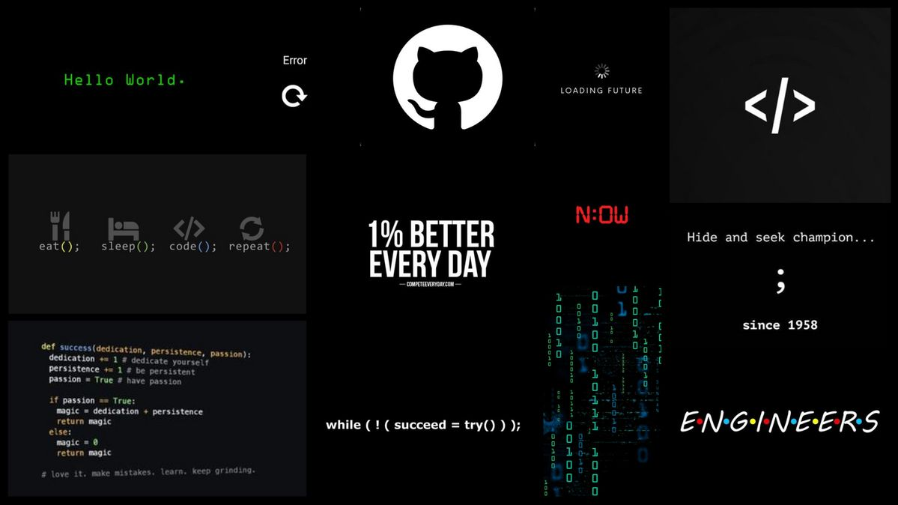

## Hello World! I'm Muhammad Rivaldhi 👋

- 🌱 I am currently learning to build **SaaS** from scratch by implementing **Microservices Architecture.**

## 📫 Get to know more about me

## Favourite Weapons ⚔

